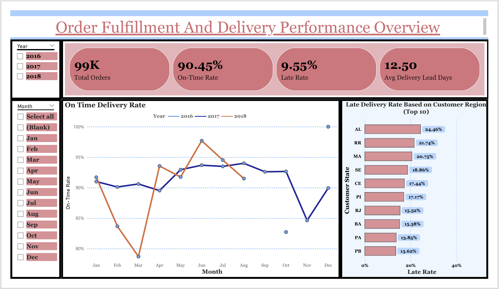

# 📦 OTIF Delivery Performance Analysis

**End-to-End Supply Chain Analytics Project (SQL + Power BI)**

## 📌 Project Overview

This project analyzes **On-Time In-Full (OTIF)** delivery performance for a multi-warehouse distribution network to identify service-level gaps, root causes of late/incomplete deliveries, and improvement opportunities across customers, regions, and carriers.

The goal is to demonstrate **real-world supply chain analytics**:

* Turning raw operational data into trusted KPIs
* Designing analytics-ready data models
* Building executive-level dashboards that drive decisions

---

## 🎯 Business Problem

OTIF performance directly impacts customer satisfaction, revenue retention, and operational cost. However, organizations often struggle with:

* Fragmented order, shipment, and delivery data
* Inconsistent KPI definitions across teams
* Limited visibility into *why* OTIF failures occur

**Key business questions answered:**

* What is the true OTIF rate across customers and regions?
* Are delays driven more by *late* deliveries or *incomplete* shipments?
* Which customers, warehouses, or carriers contribute most to OTIF failures?
* Where should operations teams prioritize improvements?

---

## 🧱 Data Architecture & Modeling

A **warehouse-style data pipeline** was designed using layered SQL models.

### Data Layers

| Layer       | Purpose                                          |
| ----------- | ------------------------------------------------ |
| **RAW**     | Ingest source order, shipment, and delivery data |
| **STAGING** | Cleaned, standardized, join-ready tables         |
| **MART**    | Business-ready fact and dimension tables         |

### Key Tables

* **Fact Tables**

  * `fact_orders`
  * `fact_deliveries`
* **Dimensions**

  * `dim_customer`
  * `dim_product`
  * `dim_warehouse`
  * `dim_date`
* **KPI Views**

  * OTIF Rate
  * On-Time %
  * In-Full %
  * Late / Partial Order Rates

---

## 📊 Key Metrics Defined

| Metric             | Definition                                                             |
| ------------------ | ---------------------------------------------------------------------- |
| **OTIF**           | Orders delivered on or before promised date **and** with full quantity |
| **On-Time Rate**   | % of orders delivered on or before promised date                       |
| **In-Full Rate**   | % of orders delivered with complete quantity                           |
| **Late Orders**    | Delivered after promised date                                          |
| **Partial Orders** | Delivered with quantity shortfall                                      |

All KPIs are **explicitly defined and validated** in SQL views to ensure consistency between analytics and reporting.

---

## 🔍 Data Quality & Validation

Data trust was prioritized through systematic checks:

* Row count reconciliation across RAW → STG → MART
* Join integrity validation
* Null and duplicate checks on business keys
* KPI sanity checks against raw aggregates

Validation logic is documented under:

```
docs/
├── load_validation.md
├── join_validation.md
├── mart_data_quality.md
```

---

## 📈 Dashboard & Insights

An interactive **Power BI dashboard** was built for operational and executive stakeholders.

### Dashboard Highlights

* Overall OTIF, On-Time, and In-Full performance
* Customer-level OTIF ranking
* Regional and warehouse comparisons
* Breakdown of OTIF failures (late vs incomplete)
* Drill-down views for root cause analysis



---

## 💡 Key Insights (Sample)

* A small subset of customers contributes disproportionately to OTIF failures
* Certain warehouses consistently miss promised delivery dates
* Late deliveries drive more OTIF loss than quantity shortfalls
* Regional performance variance suggests operational bottlenecks rather than demand issues

---

## 🛠 Tools & Technologies

* **SQL** (PostgreSQL-style warehouse modeling)
* **Power BI** (data modeling, DAX, visualization)
* **Data Warehousing Concepts**

  * Star schema
  * Fact / dimension modeling
  * KPI-driven marts

---

## 📂 Repository Structure

```
OTIF_Delivery_Performance_Analysis/
│
├── dataset/                 # Raw input datasets
├── sql/
│   ├── raw/                 # RAW table creation & validation
│   ├── stg/                 # Staging transformations
│   └── mart/                # Facts, dimensions, KPI views
│
├── powerBI/                 # Interactive dashboard
├── docs/                    # Data quality & validation notes
├── notebooks/               # (Reserved for future analysis)
└── README.md
```
---

## 🔮 Future Enhancements

* Add SLA-based service tiers by customer
* Integrate carrier-level performance analysis
* Track OTIF trends over time
* Link OTIF failures to cost impact (penalties, expediting)

